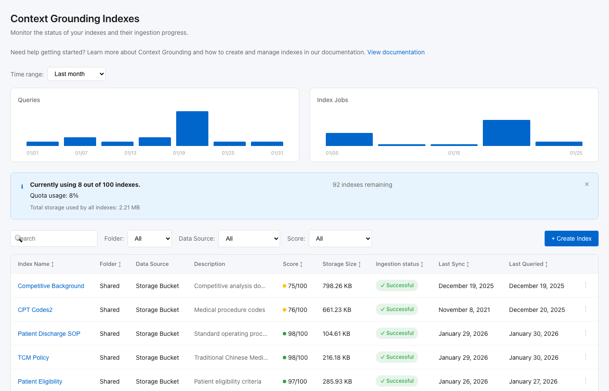

# Context Grounding Indexes UI

A React-based user interface for managing Context Grounding Indexes with support for **User Defined Fields and Filtering**. This application enables users to define field-level metadata, taxonomies, and dictionaries for data sources at configuration time, improving retrieval precision and NL-to-SQL accuracy for AI agents.



## Table of Contents

- [Overview](#overview)
- [Features](#features)
- [Quick Start](#quick-start)
- [User Guide](#user-guide)
- [Project Structure](#project-structure)
- [Development](#development)
- [Deployment](#deployment)

## Overview

### What is Context Grounding?

Context Grounding is a system that allows you to create and manage indexes of your business data. These indexes can be used to ground LLM (Large Language Model) calls, ensuring AI responses are accurate and based on your actual data rather than general knowledge.

### Why User Defined Fields and Filtering?

- **Reduces Context Engineering Guesswork**: Instead of embedding business definitions in system prompts through trial and error, structured metadata makes configuration discoverable, reusable, and auditable.
- **Improves Retrieval Precision**: Tagging documents with field-level metadata at ingestion allows retrieval algorithms to filter and rank more intelligently.
- **Enables Zero-Copy Live Data**: For Data Fabric/FQS queries, agents need schema and relationship metadata to generate correct SQL without persisting data.

## Features

### Index Management
- View all indexes with status, scores, and sync information
- Search and filter indexes by folder, data source, or score
- Monitor quota usage and storage consumption
- Track query and ingestion job statistics

### Create/Edit Index
- Configure general details (name, description, folder)
- Select data source (Storage Bucket or Connector)
- Set up automatic ingestion schedules
- Upload files directly to storage buckets

### Data Source Settings (New!)

#### 1. Field Definitions
Define which fields in your data are queryable and filterable:
- **Field Name & Display Name**: Technical and human-readable names
- **Data Type**: string, number, date, boolean, array, object
- **Description**: What the field represents
- **Example Values**: Sample data for reference
- **Queryable/Filterable**: Enable for search and filtering
- **Required for Retrieval**: Mark essential fields
- **PII Flag**: Exclude sensitive data from agent context

#### 2. Dictionary/Ontology Attachment
Attach business knowledge to improve query understanding:
- **Existing Ontologies**: Connect to Data Fabric or Ontology Definition artifacts
- **Inline Dictionary**: Create term definitions with synonyms and related terms
- **Entity Relationships**: Define how entities relate (e.g., "Invoice relates to Payment via payment_id")
- **Template Import**: Start from standards like ISA-88, FIBO, SNOMED, or Schema.org

#### 3. Data Freshness Indicator
Configure data synchronization behavior:
- **Persistent Sources**: Set refresh cadence (hourly, daily, weekly, monthly)
- **Live Sources**: Real-time queries with no caching (for SQL, Salesforce, etc.)

## Quick Start

### Prerequisites

- **Node.js** (v16 or higher) - [Download](https://nodejs.org/)
- **npm** (comes with Node.js) or **yarn**
- **Git** - [Download](https://git-scm.com/)

### Installation

1. **Clone the repository**
   ```bash
   git clone https://github.com/zkeslami/ingestion-ui-updates.git
   cd ingestion-ui-updates
   ```

2. **Install dependencies**
   ```bash
   npm install
   ```

3. **Start the development server**
   ```bash
   npm start
   ```

4. **Open in browser**

   The app will automatically open at [http://localhost:3000](http://localhost:3000)

   If it doesn't open automatically, navigate to the URL manually.

### Stopping the Server

Press `Ctrl + C` in the terminal where the server is running.

## User Guide

### Managing Indexes

#### Viewing the Index List

When you first open the application, you'll see the **Context Grounding Indexes** dashboard:

1. **Charts Section**: Displays queries and index job statistics over time
2. **Quota Banner**: Shows how many indexes you're using out of your limit
3. **Search & Filters**: Find indexes by name, folder, data source, or score
4. **Index Table**: Lists all indexes with key information

#### Creating a New Index

1. Click the **"+ Create Index"** button in the top right
2. Fill in the **General Details**:
   - **Index Name** (required): A unique identifier for your index
   - **Description**: Explain what data this index contains
   - **Folder** (required): Organize indexes into folders
3. Select a **Data Source**:
   - **Storage Bucket**: For file-based data
   - **Connector**: For external data sources
4. Configure **Additional Settings**:
   - Choose **Basic** (text only, free) or **Advanced** (text + images/tables, costs Platform Units)
5. Optionally enable **Schedule Ingestion** for automatic updates

#### Configuring Data Source Settings

After selecting a data source, the **Data Source Settings** panel appears:

##### Adding Field Definitions

1. Click **"+ Add Field Definition"**
2. Fill in the field details:
   - Field Name (e.g., `patient_id`)
   - Display Name (e.g., `Patient ID`)
   - Data Type (string, number, date, etc.)
   - Description and example values
3. Configure options:
   - Check **Queryable** to allow searching
   - Check **Filterable** to enable filtering
   - Check **Required for retrieval** for essential fields
   - Check **Sensitive/PII field** to exclude from agent context
4. Click the field header to expand/collapse details

##### Attaching Ontologies

1. Choose from three tabs:
   - **Existing Ontology**: Select from Data Fabric
   - **Inline Dictionary**: Create custom definitions
   - **Import Template**: Use standard ontologies

2. For **Inline Dictionary**:
   - Click **"+ Add Dictionary Term"**
   - Enter term, synonyms, definition, and related terms
   - Click **"+ Add Entity Relationship"** to define how entities connect

3. For **Import Template**:
   - Click on a template card (ISA-88, FIBO, SNOMED, Schema.org)
   - The template will be applied to your data source

##### Setting Data Freshness

1. Choose between:
   - **Persistent Source**: Data is cached and synced periodically
   - **Live Source**: Real-time queries, no caching

2. For Persistent Sources:
   - Select refresh cadence (hourly, daily, weekly, monthly, manual)

#### Editing an Existing Index

1. Click on any index name in the table
2. Modify settings as needed
3. Click **Save** to apply changes

### Tips for Better Results

1. **Define PII Fields**: Always mark sensitive fields to prevent data leakage
2. **Add Synonyms**: Include common variations of terms in your dictionary
3. **Document Relationships**: Explicitly define how entities connect for better SQL generation
4. **Use Appropriate Freshness**: Choose live sources only when real-time data is essential

## Project Structure

```
ingestion-ui/
├── public/                 # Static assets
├── src/
│   ├── components/         # Reusable UI components
│   │   ├── DataFreshnessIndicator.tsx
│   │   ├── FieldDefinitions.tsx
│   │   ├── Header.tsx
│   │   └── OntologyAttachment.tsx
│   ├── data/               # Mock data for development
│   │   └── mockData.ts
│   ├── pages/              # Page components
│   │   ├── CreateIndex.tsx
│   │   └── IndexList.tsx
│   ├── styles/             # Global styles
│   │   └── global.css
│   ├── types/              # TypeScript type definitions
│   │   └── index.ts
│   ├── App.tsx             # Main application component
│   └── index.tsx           # Application entry point
├── docs/
│   └── screenshots/        # UI screenshots
├── package.json
└── README.md
```

## Development

### Available Scripts

| Command | Description |
|---------|-------------|
| `npm start` | Run development server at http://localhost:3000 |
| `npm test` | Launch test runner in interactive watch mode |
| `npm run build` | Build for production to `build/` folder |
| `npm run eject` | Eject from Create React App (one-way operation) |

### Technologies Used

- **React 18** - UI library
- **TypeScript** - Type-safe JavaScript
- **CSS3** - Styling with CSS variables
- **Create React App** - Build tooling

### Making Changes

1. Edit files in `src/`
2. The browser will automatically reload with your changes
3. TypeScript errors will appear in the terminal and browser console

### Adding New Components

1. Create component file in `src/components/`
2. Create corresponding CSS file
3. Add TypeScript interfaces to `src/types/index.ts` if needed
4. Import and use in pages

## Deployment

### Building for Production

```bash
npm run build
```

This creates an optimized production build in the `build/` folder.

### Serving Production Build Locally

```bash
npm install -g serve
serve -s build
```

The production build will be available at http://localhost:3000

### Deployment Options

The build output is static files that can be deployed to:
- **Vercel**: `npx vercel`
- **Netlify**: Drag and drop `build/` folder
- **AWS S3**: Upload `build/` contents to S3 bucket with static hosting
- **GitHub Pages**: Use `gh-pages` package

## License

MIT

## Contributing

1. Fork the repository
2. Create a feature branch (`git checkout -b feature/amazing-feature`)
3. Commit your changes (`git commit -m 'Add amazing feature'`)
4. Push to the branch (`git push origin feature/amazing-feature`)
5. Open a Pull Request
